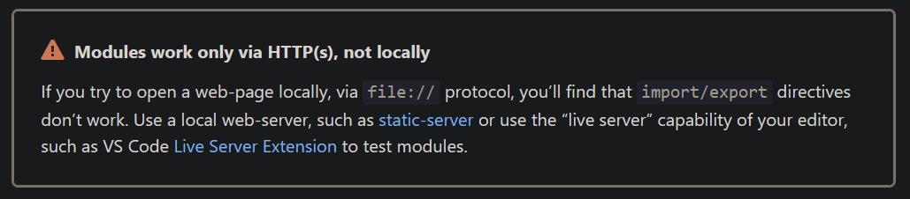

Sistema de verificação de ingressos de eventos.

Projeto desenvolvido para a sprint de Desenvolvimento Full Stack Básico da PUC Rio.

O projeto hospedado na Vercel: [https://puc-verifica-ticket.vercel.app/](https://puc-verifica-ticket.vercel.app/).

Utilizei ES modules. Descobri após finalizar o projeto que não suporta abrir o arquivo html diretamente, então é necessário rodar em um servidor local. Sugiro o uso do [live-server](https://marketplace.visualstudio.com/items?itemName=ritwickdey.LiveServer) do VS Code. Agradeço a compreensão.

